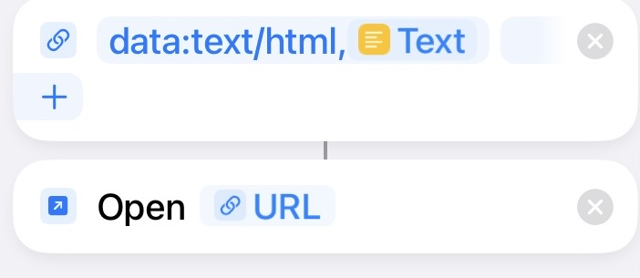

# OpenPGP-iOS-Shortcut

## Warning: The private key and passphrase will be stored in the Shortcut app, and if you turn your iCloud sync on, it may be uploaded to your iCloud storage. This is dangerous! If possible avoid directly storing your key and passphrase directly in the Shortcut app!

### How to use shortcut decrypt, encrypt and sign messages?
0. You can modify the HTML file, add new input, buttons, and Javascript functions to this file.
1. Copy the entire edited HTML as text, and put it into a Text Action like this:

2. Add a URL Action, input "data:text/html, " and add a Open URL Action like this:

3. Run this shortcut and you'll find Safari is opened.